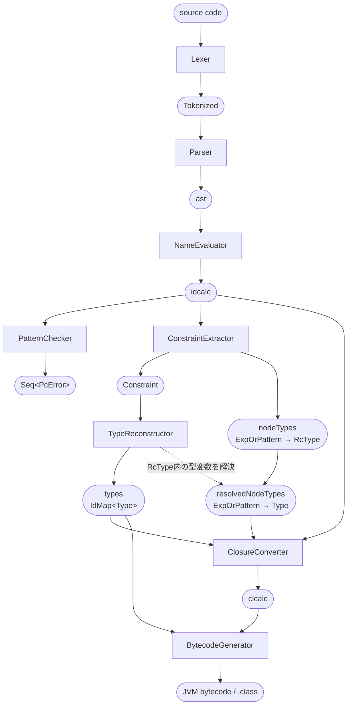

# コンパイラ見取り図

この文書は，ZLKコンパイラの全体構造，コンパイルフェーズ，主要なデータ構造，およびコードを読むための用語と命名の凡例を示す．個々のクラスやアルゴリズムの詳細は，関連するソースコードとコメントに記載されている．

## コンパイルフェーズと中間表現

`PatternChecker`は名前解決後の`IcModule`を検査する独立した経路であり，case式の冗長なパターンと網羅されていないパターンを`PcError`として報告する．

`ConstraintExtractor.Result.nodeTypes`が保持する`RcType`は，制約と型変数を共有する．そのため，`TypeReconstructor`による制約解決後に`resolvedNodeTypes()`を呼び出すことで，各式およびパターンの解決済み`Type`を取得できる．

### 主要な中間表現

#### `ast`

構文解析直後の抽象構文木．ソース上の名前と構文を保持する．構文解析後は変更せず，後続フェーズに必要な情報は別のIRまたは対応表として生成する．

#### `idcalc`

`NameEvaluator`による名前解決後のIR．ローカル変数，外部変数，データコンストラクタなどが`Id`によって識別される．`PatternChecker`，`ConstraintExtractor`，`ClosureConverter`の入力となる．

#### `Constraint`

`recon.constraint`に定義された型推論用のIR．主な構成要素は次のとおり．

- `RcType`：単一化および型再構築で使用する型
- `Constraint`：型の等式，スコープ，宣言グループなどの制約
- `Variable`：union-findによって管理される型変数
- `RcType.Anno`：型注釈をrigidな`RcType`へ変換した結果
- `RcType.Inst`：多相型をfresh flexでインスタンス化した結果

#### `clcalc`

`ClosureConverter`によるクロージャ変換後のIR．自由変数を明示的に扱い，JVMバイトコード生成の入力となる．

### `Id`とクラスファイル中の名前

`Id`は，モジュール名を根として構文上のスコープを`.`で連結した完全修飾名である．クラスファイルのメソッド名は，`Id`からモジュール名と直後の`.`を除き，残りの`.`を`$`へ置換して生成する．次の表では，モジュール名を`M`，型名を`T`，コンストラクタ名を`C`，関数名を`f`，変数名を`x`とする．`k`は0から始まるクロージャ変換時のモジュール内通し番号，`n`は1から始まる同一スコープ内のラムダ番号，`i`は0から始まるcase分岐番号またはカリー化段階番号である．

| 対象 | `Id` | クラスファイル中の名前 |
|---|---|---|
| モジュール | `Id`なし | クラス`M` |
| 型`T` | `M.T` | sealed interface `M$T` |
| コンストラクタ`C` | `M.T.C` | record `M$T$C` |
| トップレベル関数`f` | `M.f` | `M`のstaticメソッド`f` |
| 関数`f`の引数または局所変数`x` | `M.f.x` | ローカル変数スロット．名前情報なし |
| `f`内の局所関数`g` | `M.f.g` | 自由変数がなければ`f$g`．クロージャ化されれば`k$f$g` |
| `f`内の第`n`ラムダ | `M.f._lambda<n>` | クロージャ化後のメソッド`k$f$_lambda<n>` |
| case式の第`i`分岐にある変数`x` | `M.f._<i>.x` | ローカル変数スロット．名前情報なし |
| クロージャ変換後の関数 | `M.<k>.<元のモジュール以下のId>` | `<k>$<元の名前を$で連結した名前>` |
| 関数の第`i`カリー化段階 | `<元のId>.$<i>` | `<元のメソッド名>$$<i>` |
| コンストラクタの部分適用用メソッド | `M.T.C` | 必要な場合に`M`へ追加されるsyntheticメソッド`T$C` |
| コンストラクタの第`i`引数 | 専用の`Id`なし | record componentおよびprivateフィールド`val<i>` |
| 型変数 | `Id`ではなく`Type.Var` | 型消去後の`java/lang/Object` |

## パッケージ構成

### メインコード：`src/main/java/zlk`

| パッケージ | 責務 |
|---|---|
| `ast` | 抽象構文木 |
| `parser` | 字句解析と構文解析 |
| `nameeval` | 名前解決 |
| `idcalc` | 名前解決後のIR |
| `patterncheck` | パターンマッチの冗長性および網羅性の検査 |
| `recon` | 型制約の抽出と型再構築 |
| `clconv` | クロージャ変換 |
| `clcalc` | クロージャ変換後のIR |
| `bytecodegen` | JVMバイトコード生成 |
| `runtime` | 生成コードが利用する実行時interfaceと値の文字列化 |
| `common` | `Id`，`Location`，`Type`などの共通データ構造 |
| `core` | 組み込み関数と組み込み値 |
| `util` | コレクション，`Result`，Pretty Printerなどの汎用部品 |

`Main.java`は，フロントエンドが完成するまでに実装した言語機能を確認するための，コンパイルから実行までの動くサンプルである．コンパイラ全体を統括する完成したドライバではない．

## 用語と命名

### 型推論

- **flex**：単一化によって他の型へ束縛できるflexibleな型変数
- **rigid**：型注釈の検査中に他の型へ束縛できないrigidな型変数
- **generalize**：対象スコープで自由な型変数を量化すること
- **instantiate**：量化された多相型をfresh flexへ置き換えて利用可能にすること

### プロジェクト共通の省略形

長い単語には，コード全体で一貫して使用する次の省略形を定めている．

| 完全形 | 省略形 | 例 |
|---|---|---|
| Annotation | `Anno` | `IcValDecl.anno`，`RcType.Anno` |
| Constructor | `Ctor` | `IcCtor`，`IcVarCtor` |
| Instance / Instantiation | `Inst` | `RcType.Inst` |
| Expression | `Exp` | `IcExp`，`CcExp` |
| Pattern | `Pat` | `pat`，`patTy` |
| Constraint | `Con` | `bodyCon`，`headerCons` |
| Declaration | `Decl` | `IcValDecl`，`IcTypeDecl` |
| Calculation | `calc` | `idcalc`，`clcalc` |
| Conversion / Converter | `conv` | `clconv`，`ClosureConverter` |

