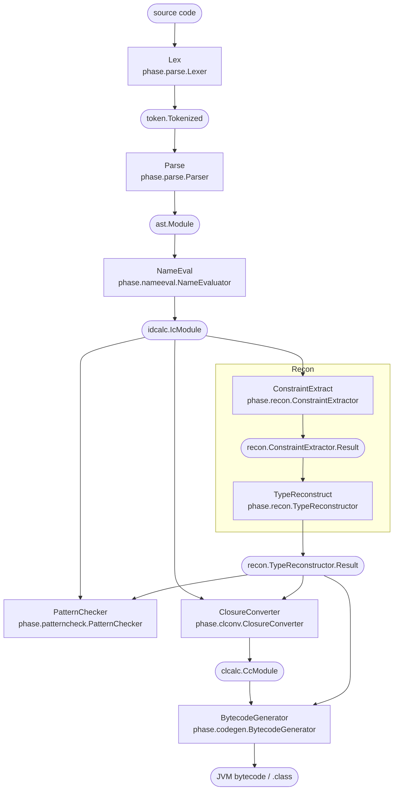

# コンパイラ見取り図

この文書は，ZLKコンパイラの全体構造，コンパイルフェーズ，主要なデータ構造，およびコードを読むための用語と命名の凡例を示す．個々のクラスやアルゴリズムの詳細は，関連するソースコードとコメントに記載されている．

## コンパイルフェーズ

```mermaid
flowchart TD
    Source(["source code"]) --> Lexer["Lex<br/>phase.parse.Lexer"]
    Lexer --> Tokens(["token.Tokenized"])
    Tokens --> Parser["Parse<br/>phase.parse.Parser"]
    Parser --> AST(["ast.Module"])
    AST --> NameEvaluator["NameEval<br/>phase.nameeval.NameEvaluator"]
    NameEvaluator --> IC(["idcalc.IcModule"])

    IC --> Extractor["ConstraintExtract<br/>phase.recon.ConstraintExtractor"]
    subgraph Recon
        Extractor --> Extracted(["recon.ConstraintExtractor.Result"])
        Extracted --> Reconstructor["TypeReconstruct<br/>phase.recon.TypeReconstructor"]
    end
    Reconstructor --> Types(["recon.TypeReconstructor.Result"])

    IC --> PatternChecker["PatternChecker<br/>phase.patterncheck.PatternChecker"]
    Types --> PatternChecker

    IC --> ClosureConverter["ClosureConverter<br/>phase.clconv.ClosureConverter"]
    Types --> ClosureConverter
    ClosureConverter --> CC(["clcalc.CcModule"])

    CC --> BytecodeGenerator["BytecodeGenerator<br/>phase.codegen.BytecodeGenerator"]
    Types --> BytecodeGenerator
    BytecodeGenerator --> Class(["JVM bytecode / .class"])
```

`Driver`は，`lexPhase`，`parsePhase`，`nameEvalPhase`，`reconPhase`，`patternPhase`，`closurePhase`，`bytecodePhase`という塊で処理を順に呼び出すことにより，各フェーズの実装を組合わせてコンパイルを実現する．
`reconPhase`は`Driver`内では1つのフェーズのように記述してあるが，内部は`ConstraintExtractor`と`TypeReconstructor`という概念上異なるフェーズを含む．

`PatternChecker`は，名前解決後の`IcModule`と型再構築後の`ExpOrPatternMap<Type>`を検査する．型再構築済みのpattern型からconstructor familyを取得するため，well-typedなpattern matrixを前提として冗長性と網羅性の検査に専念する．レコードパターンは1個以上の同名フィールド変数だけを持つ反駁不能なbinderなので，内部のpattern matrixではwildcard相当として扱う．

parser，nameeval，recon，patterncheckの各phaseは，`Driver`から渡されたreporterへ公開`Diagnostic`をreportする．`ERROR`がreportされた段階で`Driver`は後続フェーズをblockし，`CompilationResult.Failed`を返す．`WARN`と`INFO`だけの場合は，diagnostic列を保持したまま後続フェーズを継続する．

## レコード型

ZLKのレコード型は，行多相を持つ構造的型である．重要な設計は次のとおり．

レコードリテラル/パターンは1個以上のフィールドを必要とする．パターンはフィールド名と同名の変数を束縛する事ことのみ可能．
型はネスト可能で，レコード多相のRowは空も許容する．

- **RecordとRowの分離**：安定層では`Type.Record`が`Type.Row`を包み，row tailの`Type.RowVar`は値型`Type`を実装しない．制約層の`RcType.RecordN`／`RowN`，flat層の`FlatType.Record1`／`Row1`も同じ境界を保つ．union-find rootはTYPE／ROW kindを持ち，rank，generalize，instantiateの機構を共有する．
- **open rowによる一様な型推論**：アクセス，更新，レコードパターンは`ConstraintExtractor`でopen rowを含む`CEqual`へlowerする．solverはrowのlabel差分をtailへ束縛し，lacks制約で重複labelを防ぐため，個別構文向けの特例を必要としない．
- **宣言全体でのkind解決と透明alias**：`TypeResolver`は前方参照や相互再帰を含む全型宣言からparameter kindを解決する．型aliasはkind確定後に展開され，alias identityやkind情報をbackendへ持ち越さない．
- **後段では型のopen／closedを消去**：record patternは`PatternChecker`では反駁不能なbinderとして扱う．runtimeではopen／closedの区別を消去し，全レコード値をpublic `ZlkRecord` interfaceへ統一する．

## `Id`とクラスファイル中の名前

`Id`は，モジュール名を根として構文上のスコープを`.`で連結した完全修飾名である．クラスファイルのメソッド名は，`Id`からモジュール名と直後の`.`を除き，残りの`.`を`$`へ置換して生成する．次の表では，モジュール名を`M`，型名を`T`，コンストラクタ名を`C`，関数名を`f`，変数名を`x`とする．`k`は0から始まるクロージャ変換時のモジュール内通し番号，`n`は1から始まる同一スコープ内のラムダ番号，`i`は0から始まるcase分岐番号またはカリー化段階番号である．

| 対象 | `Id` | クラスファイル中の名前 |
|---|---|---|
| モジュール | `Id`なし | クラス`M` |
| 型`T` | `M.T` | sealed interface `M$T` |
| コンストラクタ`C` | `M.T.C` | record `M$T$C` |
| トップレベル関数`f` | `M.f` | `M`のstaticメソッド`f` |
| 関数`f`の引数または局所変数`x` | `M.f.x` | ローカル変数スロット．名前情報なし |
| `f`内の局所関数`g` | `M.f.g` | 自由変数がなければ`f$g`．クロージャ化されれば`k$f$g` |
| `f`内の第`n`ラムダ | `M.f._lambda<n>` | クロージャ化後のメソッド`k$f$_lambda<n>` |
| case式の第`i`分岐にある変数`x` | `M.f._<i>.x` | ローカル変数スロット．名前情報なし |
| クロージャ変換後の関数 | `M.<k>.<元のモジュール以下のId>` | `<k>$<元の名前を$で連結した名前>` |
| 関数の第`i`カリー化段階 | `<元のId>.$<i>` | `<元のメソッド名>$$<i>` |
| コンストラクタの部分適用用メソッド | `M.T.C` | 必要な場合に`M`へ追加されるsyntheticメソッド`T$C` |
| コンストラクタの第`i`引数 | 専用の`Id`なし | record componentおよびprivateフィールド`val<i>` |
| 型変数 | `Id`ではなく`Type.Var` | 型消去後の`java/lang/Object` |

## パッケージ構成

### メインコード：`src/main/java/zlk`

| パッケージ | 責務 |
|---|---|
| `common`，`common.id` | `Id`，`Location`，`Type`などの共通データ構造 |
| `compiler` | `Driver`によるコンパイルパイプラインと結果の統括 |
| `core` | 組み込み関数と組み込み値 |
| `diagnostic` | 構造化診断と診断の報告先 |
| `ir.ast` | 抽象構文木 |
| `ir.token` | 字句解析結果 |
| `ir.idcalc` | 名前解決後のIR |
| `ir.typing` | 型再構築後に後続フェーズが利用する型情報 |
| `ir.clcalc` | クロージャ変換後のIR |
| `phase` | コンパイルフェーズ共通の結果表現 |
| `phase.parse` | 字句解析と構文解析 |
| `phase.nameeval` | 名前解決と型名解決 |
| `phase.recon` | 型制約の抽出と型再構築 |
| `phase.recon.constraint` | 型制約IRと型再構築中の型表現 |
| `phase.patterncheck` | パターンマッチの冗長性および網羅性の検査 |
| `phase.clconv` | クロージャ変換 |
| `phase.codegen` | JVMバイトコード生成 |
| `runtime` | 生成コードが利用する実行時interfaceと値の文字列化 |
| `util`，`util.collection`，`util.pp` | `Result`，コレクション，Pretty Printerなどの汎用部品 |

### テストコード：`src/test/java/zlk`

| パッケージ | 責務 |
|---|---|
| `zlk` | 全テストpackageを選択するsuite |
| `zlk.test.feature.*` | 言語機能および実行時意味論のテスト |
| `zlk.test.diagnostic` | コンパイラの診断機能のテスト |
| `zlk.test.phase.*` | コンパイルフェーズごとの内部アルゴリズム等の検査 |
| `zlk.test.runtime` | 生成コードが利用するランタイムの検査 |
| `zlk.util.fixture` | `Driver`のコンパイル結果，推論型，および生成bytecodeのload・実行を扱うテスト支援ユーティリティ |
| `zlk.util.tester` | コンパイルフェーズの内部IRおよびphase固有アルゴリズムを直接検査するテスト支援ユーティリティ |

`Driver`は，コンパイルパイプラインを統括し，構造化diagnosticと`CompilationResult`を返す公開入口である．`Main.java`は，各フェーズの中間結果と生成bytecodeを表示して実行するための手動サンプルであり，通常のコンパイル入口ではない．
featureテストは`Driver`を公開入口として利用し，phaseテストだけが検査対象のコンパイルフェーズを直接組み立てる．

## 用語と命名

### 型推論

- **flex**：単一化によって他の型へ束縛できるflexibleな型変数
- **rigid**：型注釈の検査中に他の型へ束縛できないrigidな型変数
- **generalize**：対象スコープで自由な型変数を量化すること
- **instantiate**：量化された多相型をfresh flexへ置き換えて利用可能にすること

### プロジェクト共通の省略形

長い単語には，コード全体で一貫して使用する次の省略形を定めている．

| 完全形 | 省略形 | 例 |
|---|---|---|
| Annotation | `Anno` | `IcValDecl.anno`，`RcType.Anno` |
| Constructor | `Ctor` | `IcCtor`，`IcVarCtor` |
| Instance / Instantiation | `Inst` | `RcType.Inst` |
| Expression | `Exp` | `IcExp`，`CcExp` |
| Pattern | `Pat` | `pat`，`patTy` |
| Constraint | `Con` | `bodyCon`，`headerCons` |
| Declaration | `Decl` | `IcValDecl`，`IcTypeDecl` |
| Calculation | `calc` | `idcalc`，`clcalc` |
| Conversion / Converter | `conv` | `clconv`，`ClosureConverter` |
