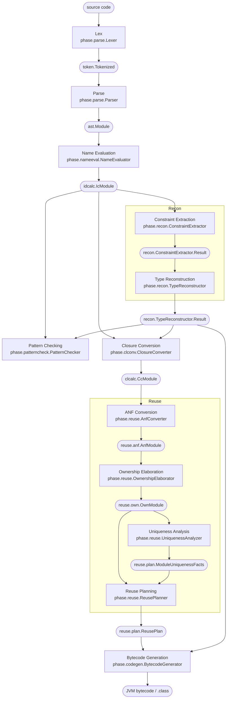

# コンパイラ見取り図

この文書は，ZLKコンパイラの全体構造，コンパイルフェーズ，主要なデータ構造，およびコードを読むための用語と命名の凡例を示す．個々のクラスやアルゴリズムの詳細は，関連するソースコードとコメントに記載されている．


## コンパイルフェーズ


```mermaid
flowchart TB
    Source(["source code"])
    Tokens(["token.Tokenized"])
    AST(["ast.Module"])
    IC(["idcalc.IcModule"])
    Extracted(["recon.ConstraintExtractor.Result"])
    Types(["recon.TypeReconstructor.Result"])
    CC(["clcalc.CcModule"])
    ANF(["reuse.anf.AnfModule"])
    Own(["reuse.own.OwnModule"])
    Unique(["reuse.plan.ModuleUniquenessFacts"])
    ReusePlanned(["reuse.plan.ReusePlan"])
    Class(["JVM bytecode / .class"])
    Lexer["Lex<br/>phase.parse.Lexer"]
    Parser["Parse<br/>phase.parse.Parser"]
    NameEval["Name Evaluation<br/>phase.nameeval.NameEvaluator"]
    Extract["Constraint Extraction<br/>phase.recon.ConstraintExtractor"]
    Reconstruct["Type Reconstruction<br/>phase.recon.TypeReconstructor"]
    PatternCheck["Pattern Checking<br/>phase.patterncheck.PatternChecker"]
    ClosureConv["Closure Conversion<br/>phase.clconv.ClosureConverter"]
    BytecodeGen["Bytecode Generation<br/>phase.codegen.BytecodeGenerator"]
    AnfConv["ANF Conversion<br/>phase.reuse.AnfConverter"]
    OwnElab["Ownership Elaboration<br/>phase.reuse.OwnershipElaborator"]
    UniqueYzer["Uniqueness Analysis<br/>phase.reuse.UniquenessAnalyzer"]
    ReusePlan["Reuse Planning<br/>phase.reuse.ReusePlanner"]

    Source --> Lexer
    Lexer --> Tokens
    Tokens --> Parser
    Parser --> AST
    AST --> NameEval
    NameEval --> IC

    IC --> Extract
    subgraph Recon
        Extract --> Extracted
        Extracted --> Reconstruct
    end
    Reconstruct --> Types

    IC --> PatternCheck
    Types --> PatternCheck

    IC --> ClosureConv
    Types --> ClosureConv
    ClosureConv --> CC

    CC --> AnfConv
    subgraph Reuse
        AnfConv --> ANF
        ANF --> OwnElab
        OwnElab --> Own
        Own --> UniqueYzer
        UniqueYzer --> Unique
        Own --> ReusePlan
        Unique --> ReusePlan
    end
    ReusePlan --> ReusePlanned

    ReusePlanned --> BytecodeGen
    Types --> BytecodeGen
    BytecodeGen --> Class
```

図の丸いノードはIR・解析結果，四角いノードはフェーズを表す．型情報や一意性解析結果は，式のIRとは別に後続フェーズへ渡す．以下のIR名は`zlk.compiler.ir`，フェーズ名は`zlk.compiler.phase`からの相対名である．`recon.*.Result`は型推論フェーズ間で受け渡す結果型であり，`phase.recon`に属する．

### IR・解析結果

| 表現 | 特徴・他の表現との違い |
|---|---|
| `token.Tokenized` | 字句とソース位置の列．式や宣言の構造は未解析 |
| `ast.Module` | ソースの構文構造．名前は文字列で保持し，構文解析後は変更しない |
| `idcalc.IcModule` | 名前を`Id`へ解決した式・宣言．型名やaliasは解決済みだが，式の型推論は未実施 |
| `recon.ConstraintExtractor.Result` | 型の等式・スコープ制約と，式・パターンに対応する推論中の型．型を求める条件の表現 |
| `recon.TypeReconstructor.Result` | 宣言の多相型と，式・パターンの型の対応表．推論中の可変な型表現ではなく，安定した`typing.Type`で保持 |
| `clcalc.CcModule` | 局所関数を持ち上げ，自由変数の捕捉を明示した式．評価順序の局所変数への展開は未実施 |
| `reuse.anf.AnfModule` | 評価順序と中間値を`LocalVar`で明示したA正規形．関数引数とcase分岐のパターンは保持 |
| `reuse.own.OwnModule` | ANFにbinderの所有状態，出現ごとの借用・消費，`Dup`／`Drop`を付与．再利用箇所は未選択 |
| `reuse.plan.ModuleUniquenessFacts` | 各束縛の右辺評価直前に，一意と保証できる値の情報．Own IRを書き換えない解析結果 |
| `reuse.plan.ReusePlan` | Own IRと，in-place更新するレコード更新箇所の集合．一意性の情報から選んだ具体的な最適化計画 |

### フェーズ

| フェーズ | 役割・他のフェーズとの違い |
|---|---|
| `parse.Lexer` | ソース文字列を字句列へ分割．構文の組立てはParserの責務 |
| `parse.Parser` | 字句列からASTを構築．名前の参照先や型は解決しない |
| `nameeval.NameEvaluator` | 名前の参照先，型名，型aliasを解決．式の型の整合性は型推論で検査 |
| `recon.ConstraintExtractor` | 式・パターン・型注釈から型制約を抽出．制約の解決は行わない |
| `recon.TypeReconstructor` | 単一化と汎化により型制約を解き，型を再構築．パターンの網羅性は検査しない |
| `patterncheck.PatternChecker` | 型が確定したパターンの冗長性と網羅性を検査．IRの変換やパターンのコード生成は行わない |
| `clconv.ClosureConverter` | 局所関数を持ち上げ，捕捉する自由変数を明示．所有権や値の一意性は扱わない |
| `reuse.AnfConverter` | 評価順序を束縛列へ展開し，中間値を明示．パターンの分解・分岐命令への変換は行わない |
| `reuse.OwnershipElaborator` | 値の生存に基づき借用・消費と`Dup`／`Drop`を明示．in-place更新の可否は決めない |
| `reuse.UniquenessAnalyzer` | Own IRから値の一意性を解析．最適化箇所の選択やIRの変更は行わない |
| `reuse.ReusePlanner` | 一意な値を消費するレコード更新を，再利用箇所として選択．命令生成は後段へ委ねる |
| `codegen.BytecodeGenerator` | 型情報と再利用計画からJVMクラスを生成．パターンを分解・分岐へ変換し，JVM上の値表現と命令を決定 |

`compiler.driver.Driver`は，これらのフェーズを順に実行する公開入口である．コンパイルオプションを適用し，生成クラスと診断を`CompilationResult`へまとめる．エラー時は後続フェーズへ進まず，警告・情報診断だけの場合はコンパイルを継続する．

## レコード型

ZLKのレコード型は，行多相を持つ構造的型である．重要な設計は次のとおり．

レコードリテラルとレコードパターンは1個以上のフィールドを必要とする．レコードパターンは同名フィールド変数の列だけからなり，renameやネストしたパターンを持たない．
レコード型はネスト可能で，行多相のRowは空のフィールド列も許容する．

- **RecordとRowの分離**：安定層では`Type.Record`が`Type.Row`を包み，row tailの`Type.RowVar`は値型`Type`を実装しない．制約層の`RcType.RecordN`／`RowN`，flat層の`FlatType.Record1`／`Row1`も同じ境界を保つ．union-find rootはTYPE／ROW kindを持ち，rank，generalize，instantiateの機構を共有する．
- **open rowによる一様な型推論**：アクセス，更新，レコードパターンは`ConstraintExtractor`でopen rowを含む`CEqual`へlowerする．solverはrowのlabel差分をtailへ束縛し，lacks制約で重複labelを防ぐため，個別構文向けの特例を必要としない．
- **宣言全体でのkind解決と透明alias**：`TypeResolver`は前方参照や相互再帰を含む全型宣言からparameter kindを解決する．型aliasはkind確定後に展開され，alias identityやkind情報をbackendへ持ち越さない．
- **後段では型のopen／closedを消去**：record patternは`PatternChecker`では反駁不能なbinderとして扱う．runtimeではopen／closedの区別を消去し，全レコード値をpublic `ZlkRecord` interfaceへ統一する．

## `Id`とクラスファイル中の名前

`Id`は，モジュール名を根として構文上のスコープを`.`で連結した完全修飾名である．クラスファイルのメソッド名は，`Id`からモジュール名と直後の`.`を除き，残りの`.`を`$`へ置換して生成する．次の表では，モジュール名を`M`，型名を`T`，コンストラクタ名を`C`，関数名を`f`，変数名を`x`とする．`k`は0から始まるクロージャ変換時のモジュール内通し番号，`n`は1から始まる同一スコープ内のラムダ番号またはcase番号，`m`は1から始まるcase内のbranch番号，`i`は0から始まるカリー化段階番号である．

| 対象 | `Id` | クラスファイル中の名前 |
|---|---|---|
| モジュール | `Id`なし | クラス`M` |
| 型`T` | `M.T` | sealed interface `M$T` |
| コンストラクタ`C` | `M.T.C` | record `M$T$C` |
| トップレベル関数`f` | `M.f` | `M`のstaticメソッド`f` |
| 関数`f`の引数または局所変数`x` | `M.f.x` | ローカル変数スロット．名前情報なし |
| `f`内の局所関数`g` | `M.f.g` | 自由変数がなければ`f$g`．クロージャ化されれば`k$f$g` |
| `f`内の第`n`ラムダ | `M.f._lambda<n>` | クロージャ化後のメソッド`k$f$_lambda<n>` |
| `f`内の第`n`case式の第`m` branchにある変数`x` | `M.f._case<n>_<m>.x` | ローカル変数スロット．名前情報なし |
| クロージャ変換後の関数 | `M.<k>.<元のモジュール以下のId>` | `<k>$<元の名前を$で連結した名前>` |
| 関数の第`i`カリー化段階 | `<元のId>.$<i>` | `<元のメソッド名>$$<i>` |
| コンストラクタの部分適用用メソッド | `M.T.C` | 必要な場合に`M`へ追加されるsyntheticメソッド`T$C` |
| コンストラクタの第`i`引数 | 専用の`Id`なし | record componentおよびprivateフィールド`val<i>` |
| 型変数 | `Id`ではなく`Type.Var` | 型消去後の`java/lang/Object` |

同一スコープ内のcase式には1から始まる番号を割り当て，各case式内のbranchには1から始まる番号を割り当てる．case branchが作る内部スコープでは，その内部にあるcase式の番号を再び1から割り当てる．例えば，次のIdは順に，`f`のスコープにある第1 case式の第1 branchの変数`x`，同じスコープにある第2 case式の第1 branchの変数`x`，および後者のbranch内にある第1 case式の第1 branchの変数`y`を表す．

```text
M.f._case1_1.x
M.f._case2_1.x
M.f._case2_1._case1_1.y
```

## パッケージ構成

### メインコード：`src/main/java/zlk`

| パッケージ | 責務 |
|---|---|
| `compiler` | Driverと各フェーズで共有する`CompilationOptions`と`PhaseResult` |
| `compiler.driver` | コンパイルパイプラインの統括と，診断を含むコンパイル結果 |
| `compiler.builtin` | 組込み値の名前，ZLKの型，JVM命令列による実装 |
| `compiler.diagnostic` | 構造化診断と診断の報告先 |
| `compiler.id` | 解決済み識別子`Id`と，その対応表・集合 |
| `compiler.source` | ソース文字列と位置・範囲 |
| `compiler.ir`以下 | 各段階のIR，安定した型情報，解析結果．詳細は「コンパイルフェーズ」を参照 |
| `compiler.phase`以下 | 各コンパイルフェーズの実装と内部表現．詳細は「コンパイルフェーズ」を参照 |
| `compiler.jvm` | 組込み定義とコード生成で共有する，ASMを用いたJVM命令生成部品 |
| `runtime` | 生成プログラムが利用する公開interfaceと値の文字列化 |
| `runtime.internal` | レコード実装と，生成コードが呼び出す内部ABI |
| `util`以下 | コンパイラに依存しないコレクション，Pretty Printerなどの汎用部品 |

`compiler`直下の共通契約は`driver`や`phase`に依存しない．`builtin`とコード生成は`jvm`の部品を共有し，`runtime`はコンパイラから独立している．

### テストコード：`src/test/java/zlk`

| パッケージ | 責務 |
|---|---|
| `zlk` | 全テストpackageを選択するsuite |
| `zlk.test.feature.*` | Driverを入口とする言語機能，推論型，生成クラスのlink・実行時意味論のテスト |
| `zlk.test.diagnostic` | Driverを入口とする公開診断とコンパイル成否のテスト |
| `zlk.test.phase.*` | 対象フェーズを直接利用した，内部アルゴリズムとIRの検査 |
| `zlk.test.runtime` | runtime APIを直接利用した，値の振舞いと内部ABIの検査 |
| `zlk.util.fixture` | `Driver`のコンパイル結果，推論型，および生成bytecodeのload・実行を扱うテスト支援ユーティリティ |
| `zlk.util.tester` | コンパイルフェーズの内部IRおよびphase固有アルゴリズムを直接検査するテスト支援ユーティリティ |

`Main.java`は，各フェーズの中間結果と生成bytecodeを表示して実行するための手動サンプルであり，通常のコンパイル入口ではない．

## 用語と命名

### 型推論

- **flex**：単一化によって他の型へ束縛できるflexibleな型変数
- **rigid**：型注釈の検査中に他の型へ束縛できないrigidな型変数
- **generalize**：対象スコープで自由な型変数を量化すること
- **instantiate**：量化された多相型をfresh flexへ置き換えて利用可能にすること

### 再利用解析

- **Ownership**：binderが保持する参照の所有状態．値の一意性とは別の情報
  - **OWNED**：所有参照を保持し，最終的に`TAKE`または`Drop`する責任を持つ状態
  - **BORROWED**：所有参照を他で保持しており，このbinderでは`Drop`しない状態．将来のborrowed parameterなどに向けた区分
- **UseMode**：出現（右辺）が所有参照を消費するか
  - **TAKE**：消費して所有権はcalleeに移る
  - **BORROW**：消費しない
- **Dup/Drop**：Own IR上での所有参照の複製・破棄．現在のJVMコード生成では参照カウント操作を出力せず，メモリ管理はGCに委ねる
- **aliveness**：以降に変数が出現するか
- **uniqueness**：同じ実体を指す参照が他にないと保証できるか

### プロジェクト共通の省略形

長い単語には，コード全体で一貫して使用する次の省略形を定めている．

| 完全形 | 省略形 | 例 |
|---|---|---|
| Annotation | `Anno` | `IcValDecl.anno`，`RcType.Anno` |
| Constructor | `Ctor` | `typing.Ctor`，`IcExp.IcVarCtor` |
| Instance / Instantiation | `Inst` | `RcType.Inst` |
| Expression | `Exp` | `IcExp`，`CcExp` |
| Pattern | `Pat` | `pat`，`patTy` |
| Constraint | `Con` | `bodyCon`，`headerCons` |
| Declaration | `Decl` | `IcValDecl`，`typing.TypeDecl` |
| Calculation | `calc` | `idcalc`，`clcalc` |
| Conversion / Converter | `conv` | `clconv`，`ClosureConverter` |
| Statement | `stmt` | `stmts`，`OwnStmt` |
